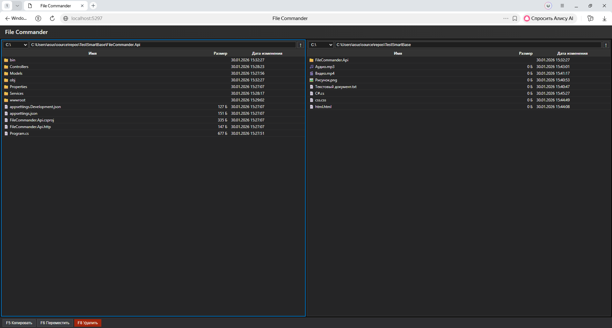

# File Commander

Веб-приложение для просмотра и управления файлами и каталогами с двухпанельным интерфейсом в стиле Total Commander.

## Описание

File Commander - это современное веб-приложение, состоящее из раздельных FrontEnd и BackEnd частей, взаимодействующих через HTTP API. Интерфейс визуально напоминает классические файловые менеджеры (Total Commander, Norton Commander, Midnight Commander, Far Manager).

### Основные возможности

- **Двухпанельный интерфейс** - две независимые панели для навигации по файловой системе
- **Просмотр файлов и директорий** с отображением:
  - Иконок типов файлов (текстовые, изображения, аудио, видео, программы)
  - Размера файлов в человеко-понятном формате (Б, КБ, МБ, ГБ, ТБ)
  - Даты изменения в формате `dd.MM.yyyy HH:mm:ss`
- **Операции над файлами и директориями**:
  - Копирование (F5)
  - Перемещение (F6)
  - Удаление (F8)
- **Навигация**:
  - Выбор корневого диска
  - Переход в родительскую директорию
  - Двойной клик для входа в директорию

## Технологии

- **BackEnd**: ASP.NET Core (.NET 10)
- **FrontEnd**: Vanilla JavaScript, HTML5, CSS3
- **Архитектура**: RESTful API, разделение UI и BackEnd

## Структура проекта

```
FileCommander.Api/
├── Controllers/          # API контроллеры
│   └── FileSystemController.cs
├── Models/               # DTO модели
│   ├── FileEntryDto.cs
│   └── FileOperationRequest.cs
├── Services/             # Бизнес-логика
│   ├── IFileSystemService.cs
│   └── FileSystemService.cs
├── wwwroot/             # FrontEnd (статичные файлы)
│   ├── index.html
│   ├── styles.css
│   └── main.js
└── Program.cs           # Точка входа приложения
```

## Архитектура

### BackEnd

Приложение построено на принципах чистой архитектуры с разделением на слои:

- **Controllers** - HTTP endpoints для взаимодействия с клиентом
- **Services** - бизнес-логика работы с файловой системой
- **Models** - DTO для передачи данных между слоями

### FrontEnd

FrontEnd реализован как Single Page Application (SPA) с использованием ванильного JavaScript:

- Модульная структура кода
- Асинхронные запросы к API через Fetch API
- Управление состоянием панелей
- Обработка пользовательских действий

### API Endpoints

- `GET /api/filesystem/drives` - получение списка доступных дисков
- `GET /api/filesystem/entries?path={path}` - получение содержимого директории
- `POST /api/filesystem/copy` - копирование файлов/директорий
- `POST /api/filesystem/move` - перемещение файлов/директорий
- `POST /api/filesystem/delete` - удаление файлов/директорий

## Установка и запуск

### Требования

- .NET SDK 10.0 или выше
- Браузер с поддержкой современных стандартов JavaScript

### Запуск приложения

1. Клонируйте репозиторий:
```bash
git clone <repository-url>
cd TestSmartBase
```

2. Перейдите в директорию проекта:
```bash
cd FileCommander.Api
```

3. Восстановите зависимости (если необходимо):
```bash
dotnet restore
```

4. Запустите приложение:
```bash
dotnet run
```

5. Откройте браузер и перейдите по адресу:
   - HTTP: `http://localhost:5000`
   - HTTPS: `https://localhost:5001`

## Использование

### Навигация

- **Выбор диска**: Используйте выпадающий список в заголовке панели
- **Переход в директорию**: Двойной клик по директории
- **Переход на уровень выше**: Нажмите кнопку `↑` в заголовке панели
- **Активация панели**: Клик по любой области панели

### Выделение элементов

- Клик по файлу/директории для выделения/снятия выделения
- Можно выделить несколько элементов

### Операции

- **Копирование (F5)**: Копирует выделенные элементы из активной панели в неактивную
- **Перемещение (F6)**: Перемещает выделенные элементы из активной панели в неактивную
- **Удаление (F8)**: Удаляет выделенные элементы из активной панели (с подтверждением)

## Скриншоты интерфейса

<!-- Здесь будут размещены скриншоты интерфейса приложения -->
<!-- Добавьте скриншоты в папку screenshots/ и обновите ссылки ниже -->

### Главный экран


### Операции с файлами


## Особенности реализации

### Гибкость архитектуры

- Использование интерфейсов (`IFileSystemService`) позволяет легко заменять реализацию
- Разделение на слои упрощает тестирование и поддержку
- DTO модели обеспечивают четкий контракт между FrontEnd и BackEnd

### Читаемость кода

- Понятные имена классов и методов
- Комментарии в ключевых местах
- Структурированная организация файлов
- Следование принципам SOLID

### Безопасность

- Валидация входных данных на уровне API
- Обработка ошибок с понятными сообщениями
- CORS настроен для разработки (в продакшене следует ограничить)

## Развитие проекта

Возможные улучшения:

- [ ] Аутентификация и авторизация пользователей
- [ ] Ограничение доступа к определенным директориям
- [ ] Пагинация для больших директорий
- [ ] Поиск файлов
- [ ] Сортировка по различным критериям
- [ ] Контекстное меню
- [ ] Поддержка перетаскивания файлов (drag & drop)
- [ ] История навигации
- [ ] Закладки на часто используемые директории

## Лицензия

Этот проект создан в образовательных целях.

## Автор

Проект выполнен в рамках тестового задания.
